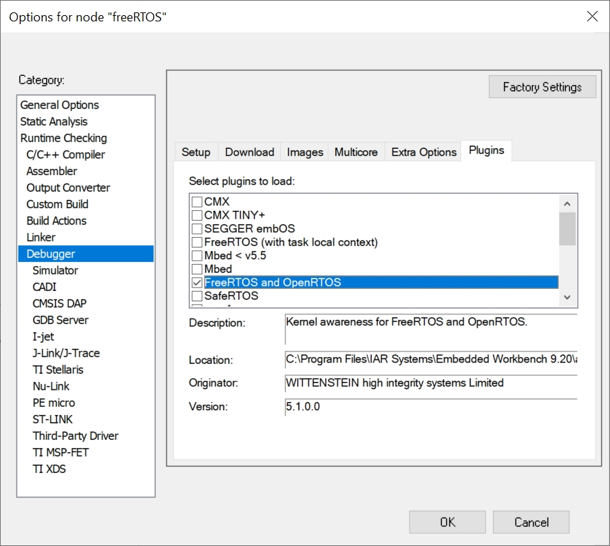
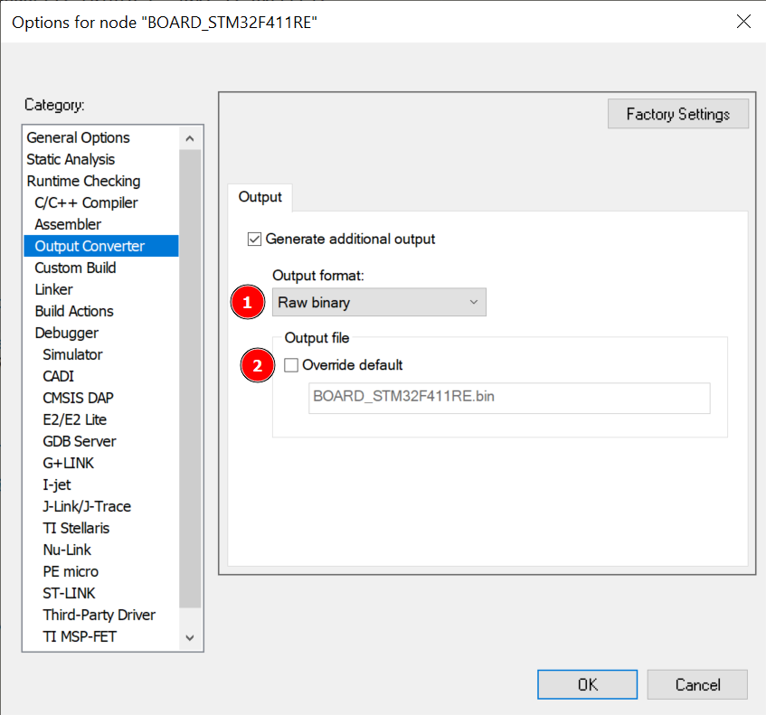
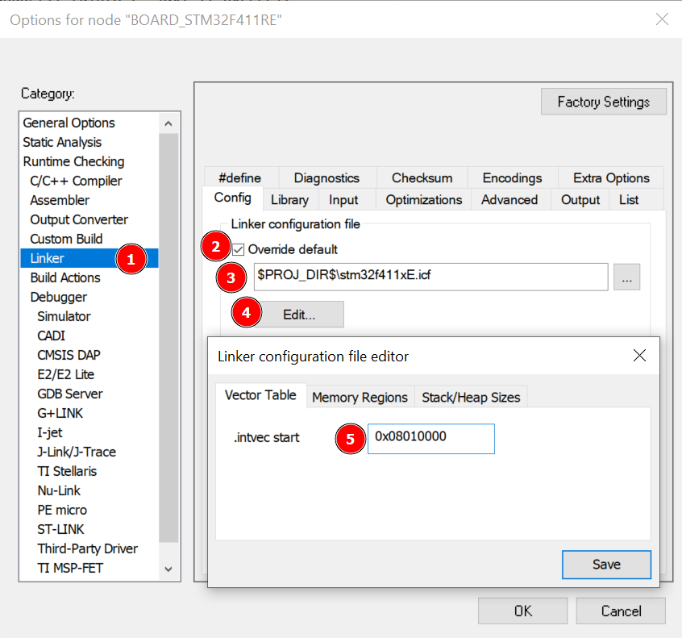
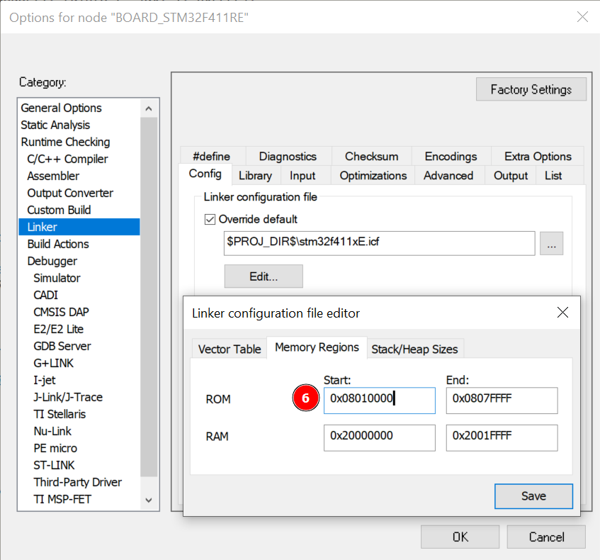

# описание проектов IAR

## 1_BOARD_STM32F411RE
заготовка под новый проэкт с настроенной стандартной периферией платы под МК STM32F411RE 

## 2_VT100 terminal
настройки COM порта 115200 8N1 
 
внешний вид 

настройки терминальной программы: 

 
references: 
<a href="http://microsin.net/adminstuff/xnix/ansivt100-terminal-control-escape-sequences.html">Управляющие кодовые последовательности терминала ANSI/VT100</a> 
<a href="https://pixelplus.ru/samostoyatelno/stati/vnutrennie-faktory/tablica-simvolov-unicode.html">Таблица символов Юникода</a> 
<a href="http://vkontakte.doguran.ru/kak-pisat-simvolami.php">создать надпись из символов</a> 
<a href="https://studfile.net/preview/16485874/page:123/">Правильный способ чтения значений даты/времени</a> 

## 3_freeRTOS
для начала включаем отладочный плагин freeRTOS в IAR 

вывод отладочной информации на дисплей (старая реализация) 
https://user-images.githubusercontent.com/65393007/173113990-68118f72-7dc7-4784-ab09-c65a8d762e3c.mp4
 
references: 
<a href="https://github.com/RusikOk/board-STM32F411RET6-Terraelectronica/blob/main/2_datasheet/%D0%90%D0%BD%D0%B4%D1%80%D0%B5%D0%B9%20%D0%9A%D1%83%D1%80%D0%BD%D0%B8%D1%86%20-%20FreeRTOS%201-9%20%D1%87%D0%B0%D1%81%D1%82%D0%B8.pdf">Андрей Курниц - FreeRTOS 1-9 части</a> 
<a href="https://github.com/RusikOk/board-STM32F411RET6-Terraelectronica/blob/main/2_datasheet/%D0%90%D0%BD%D0%B4%D1%80%D0%B5%D0%B9%20%D0%9A%D1%83%D1%80%D0%BD%D0%B8%D1%86%20-%20FreeRTOS%2010%20%D1%87%D0%B0%D1%81%D1%82%D1%8C.pdf">Андрей Курниц - FreeRTOS 10 часть</a> 
<a href="https://github.com/RusikOk/board-STM32F411RET6-Terraelectronica/blob/main/2_datasheet/SSD1306.pdf">datasheet SSD1306</a> 
<a href="https://habr.com/ru/post/352782/">Отладка многопоточных программ на базе FreeRTOS</a> 
<a href="https://github.com/STMicroelectronics/STM32CubeF0/tree/master/Utilities/CPU">загрузка ЦП</a> 
<a href="https://percepio.com/iar/">Tracealyzer and IAR Embedded Workbench</a> 

## 8_blinkForBootloader
настройка типа выходного файла в IAR 

настройка адреса таблицы векторов прерываний и адреса начала программы

 
references: 
<a href="https://microsin.net/programming/arm/creating-a-bootloader-for-cortex-m.html">IAR: создание загрузчика для Cortex-M</a> 
<a href="https://microsin.net/programming/arm-troubleshooting-faq/iar-change-program-start-address.html">IAR EWB for ARM: как поменять абсолютный начальный адрес выполнения программы</a> 
<a href="https://microtechnics.ru/mikrokontroller-i-bootloader-prakticheskaya-realizaciya-dlya-stm32/">Микроконтроллер STM32 и Bootloader. Пример реализации.</a> 
<a href="https://habr.com/ru/articles/754216/">23 Атрибута Хорошего Загрузчика</a> 
<a href="https://habr.com/ru/articles/789598/">Bootloader. Part 1. Нюансы Cortex-M, устройство памяти stm32 и преднастройка</a> 
<a href="https://habr.com/ru/articles/432966/">Загрузчик с шифрованием для STM32</a> 
<a href="https://habr.com/ru/articles/432966/comments/#comment_19492260">в void ExecMainFW() возможно падение в хард фаулт...</a> 
<a href="https://habr.com/ru/articles/112733/">Как устроен AES</a> 
<a href="https://github.com/kokke/tiny-AES-c">Tiny AES in C</a> 

<!-- h2></h2>

## STM32F103RET6
заготовка под новый проэкт с настроенной стандартной периферией платы под МК STM32F103. <b>не актуально !!!</b>
